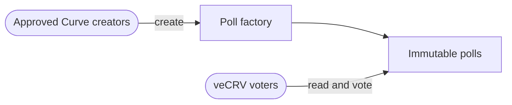

# veCRV Choice Poll

veCRV Choice Poll is a small preference system for questions with more than two answers. A veCRV holder can put all of their voting power behind one choice or split it across several choices in a single vote.

A poll records what voters prefer. It does not make protocol changes by itself; any change still follows Curve's normal governance process.

## Architecture



## How a poll works

1. An approved Curve multisig creates a poll with a title, choices, quorum, and voting window.
2. The poll takes a snapshot of veCRV balances from the block immediately before creation.
3. During the voting window, each address submits one complete allocation totaling exactly 100%.
4. After the window closes, the highest-scoring choice wins. An exact tie has no winner.

Creators provide 2–64 choices. There are no built-in choices; a creator can add an abstain-style choice when appropriate.

The shortest creation call starts voting immediately and closes it after seven days. A creator can instead provide a future start time, or both an absolute start and end time. Once created, a poll's title, choices, snapshot, quorum, and window cannot change.

## Who can create polls

The factory is intentionally specific to Ethereum mainnet veCRV.

- Curve's Ownership Agent is always an approved creator.
- The factory deployer supplies one to eight initial trusted creator multisigs at deployment.
- Only the Ownership Agent can later add or remove trusted creators.
- The deployer receives no continuing authority unless its address was explicitly included as a creator.

Every poll created by the canonical factory is therefore attributable to a currently approved Curve creator. Anyone can deploy lookalike contracts, so voters should use the published canonical factory address.

## Contracts

`ChoicePoll.vy` is an immutable poll. It reads voting power from Curve's canonical VotingEscrow at `0x5f3b5DfEb7B28CDbD7FAba78963EE202a494e2A2`.

`ChoicePollFactory.vy` deploys polls from one immutable ERC-5202 blueprint and keeps a sequential registry for discovery. Curve's Ownership Agent at `0x40907540d8a6C65c637785e8f8B742ae6b0b9968` manages the creator allowlist.

Scores are stored without rounding:

```text
choice score contribution = snapshot veCRV × allocated basis points
sum of all choice scores = participating veCRV × 10,000
```

`choices()` returns every label with its current score, while non-reverting `status()` reports the phase, quorum, tie, and final winner.

The contracts hold no assets, make no arbitrary calls, have no upgrade path, and cannot make protocol changes.

## Voter interface

The interface has one purpose: show factory polls and let a voter submit an allocation. It reads results without a wallet, supports multiple injected wallets through EIP-6963, follows account and network changes, switches to Ethereum when needed, simulates the vote before sending it, and waits for confirmation.

No backend is required: the browser reads Ethereum directly and the connected wallet signs votes.

Configure and run it locally:

```sh
cd ui
cp .env.example .env.local
# Set VITE_FACTORY_ADDRESS and VITE_ETHEREUM_RPC_URL.
npm install
npm run dev
```

The interface displays a clear deployment-pending state until the canonical factory address is configured. It never accepts an arbitrary factory address from a voter.

## Repository layout

```text
contracts/   Vyper poll, factory, and VotingEscrow interface
tests/       Titanoboa unit, property, gas, and optional mainnet-fork tests
scripts/     Reproducible build and mainnet deployment tools
ui/          Minimal voter application
```

## Development

Python 3.10, Vyper 0.4.3, and Titanoboa 0.2.8 are pinned.

```sh
uv sync --all-groups
uv run python scripts/build.py
uv run pytest -q
```

The mainnet-fork test is skipped unless `MAINNET_RPC_URL` is set. It runs at a fixed block and confirms that a poll reads the hard-coded canonical VotingEscrow.

Validate the interface separately:

```sh
cd ui
npm ci
npm audit
npm run lint
npm run typecheck
npm test
```

## Deployment

Mainnet deployment is a two-contract sequence: deploy the reviewed poll blueprint, then deploy the immutable factory pointing to it. The deploy script verifies the chain, the factory's blueprint reference, and every initial creator before writing a deployment record.

```sh
# Load MAINNET_RPC_URL and DEPLOYER_PRIVATE_KEY into the environment without printing them.
uv run python scripts/deploy.py \
  --creator 0xFirstTrustedMultisig \
  --creator 0xSecondTrustedMultisig
```

Before a production deployment:

1. Review and audit the exact pinned source and compiler artifacts.
2. Agree on the minimum initial creator multisig list.
3. Deploy and publish the blueprint, factory address, sources, and constructor arguments.
4. Set the factory address in the voter interface and redeploy it.
5. For each poll, publish its factory ID, child address, creator, snapshot block, window, quorum, and exact choice ordering.

Do not reuse a deployment record or silently replace a factory. New poll logic requires a new reviewed blueprint and factory; existing polls remain unchanged.
